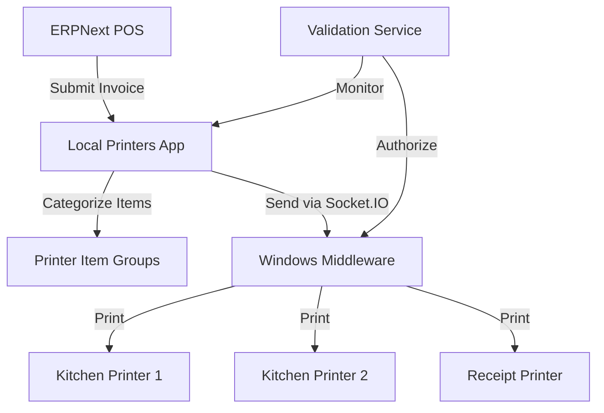

# Local Printers - ERPNext POS Printing Solution

[](https://frappeframework.com)
[](LICENSE)

A Frappe/ERPNext application that enables categorized printing of POS invoices to multiple kitchen printers through a Windows middleware system.

## Features

### Printer Management
- 🖨️ **Multi-Printer Support**: Route different item groups to specific printers
- 🏷️ **Item Group Mapping**: Assign items to printers based on categories
- 🔄 **Auto-Discovery**: Detect and save available printers from Windows middleware
- 💳 **Cashier Printer**: Special designation for receipt printers

### POS Integration
- 🧾 **Real-time Printing**: Automatically sends invoices on submission
- 🔢 **Order Numbering**: Sequential daily order tracking (resets at midnight)
- 📦 **Item Filtering**: Distributes items to appropriate printers
- 🔌 **Websocket Support**: Real-time communication with middleware

### Security & Monitoring
- 🔒 **Whitelist Control**: Restrict access to authorized systems
- 📝 **Activity Logging**: Track all printing activities
- 🛡️ **Frappe Permission System**: Leverages built-in security model

## System Architecture



## Installation

1. Add to your Frappe bench:
```bash
bench get-app local_printers https://github.com/Ahmed-Mansy-Mansico/local_printers
bench --site [your-site] install-app local_printers
bench migrate
```

2. Install the required middleware:
- [Windows Middleware App](https://github.com/Ahmed-Mansy-Mansico/local_printers_winapp)

## Configuration

### 1. Printer Setup
1. Navigate to **Printer Item Group** doctype
2. Create entries for each printer with:
   - POS Profile
   - Printer Name/IP
   - Item Group assignments
   - Cashier printer flag (for receipts)

### 2. POS Profile
Link your POS Profile to the printer configuration

## Core Functionality

### `utils.py` Key Methods

#### `send_si_details_on_submit(doc, method)`
- Triggers on Sales Invoice submission
- Gets printer settings and formats data
- Publishes real-time event to middleware

#### `get_printer_settings(invoice_doc, pos_profile)`
- Retrieves printer configurations
- Maps items to printers based on item groups
- Returns dictionary of printers with assigned items

#### `get_order_no()`
- Generates sequential order numbers
- Resets daily at midnight
- Based on submitted invoice count

## Doctypes

### Printer Item Group
- Defines printer configurations
- Maps item groups to printers
- Contains POS profile and company settings

### Printer Name
- Stores available printer names
- Auto-populated from middleware

### Get Printers
- Handles printer discovery requests
- Interfaces with middleware

## API Endpoints

### `save_printers_data(printers)`
- Stores printer names from middleware
- Whitelisted method for Windows app

### `receive_url(url)`
- Handles URL callbacks
- Creates Get Printers documents

## Related Projects

- [Windows Middleware](https://github.com/Ahmed-Mansy-Mansico/local_printers_winapp)
- [Validation Service](https://github.com/Ahmed-Mansy-Mansico/validate_local_printers)

## License

MIT License - See [LICENSE](LICENSE) for details.
```

This README includes:

1. Clear badges showing compatibility and license
2. Comprehensive feature overview with icons
3. Visual system architecture diagram
4. Step-by-step installation instructions
5. Configuration guidance
6. Core functionality documentation
7. Doctype reference
8. API endpoint details
9. Related project links
10. License information

The document is structured to help both administrators setting up the system and developers needing to understand the implementation details. The mermaid diagram provides a quick visual understanding of how the components interact.
